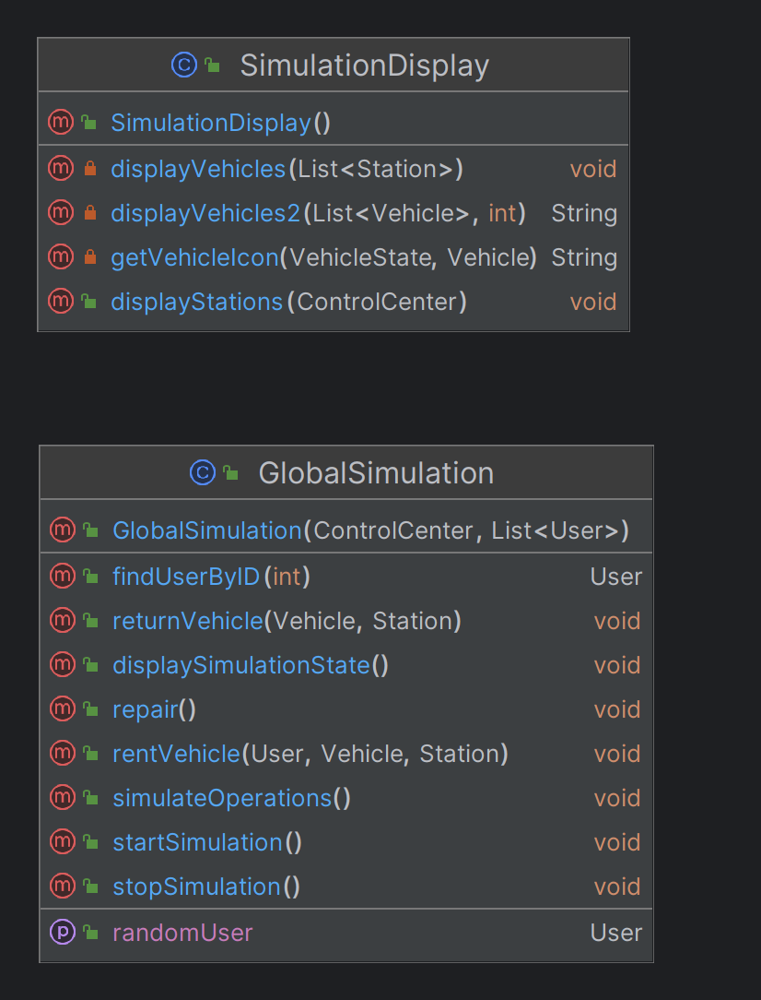

# [L3S5 COO] — Projet de conception orientée objet

Travail du binôme:

- Nawfel Belfodil
- Anton Rychwalski

-----

## How to

Pour compiler le programme, faîtes dans /projet-coo : 
```
mvn clean compile exec:java
```

Pour tester le programme, faîtes dans /projet-coo :
```
mvn test
```

### Voici notre diagramme UML général:


### Diagramme UML des véhicules (Nous avons décidé de faire un décorator pattern pour ajouter les paniers et autres objets aux véhicules en libre service) :


### Diagramme UML du centre de contrôle (Nous avons utilisé un Observer pattern qui permet à chaque dépôt et retrait de notifier le centre de contrôle):


### Diagramme UML des stations :


### Diagramme UML des métiers et autres (Nous avons utilisé un Visitor pattern permettant de facilement réparer ou voler un véhicule) :


### Diagramme UML de la redistribution (Nous avons utilisé un Strategy pattern)


### Diagramme UML des utilisateurs (Ils louent des vélos grâce à leur porte-monnaie) :


### Diagramme de la simulation :



-----
## À faire _avant_ de commencer à coder

1. Forkez ce dépôt modèle et penser à donner accès à votre encadrant de TD/TP.
2. Dans votre IDE, importez le dépôt en tant que projet `maven` et maintenez-le en tant que tel par la suite.
   Par exemple la commande `mvn test` doit compiler le projet et lancer tous les tests JUnit.
3. Appropriez-vous votre dépôt :
    - renseignez vos noms dans le `README.md`,
    - créez le package principal de votre projet,
    - vérifiez les droits d'accès sur Gitlab (binômes et enseignant),
    - supprimez ce qui est superflu (ces consignes, le code d'exemple, etc)

[l3s5 coo]: http://portail.fil.univ-lille.fr/ls5/coo "UE Conception Orientée Object (portail pédagogique FIL)"

[consignes]: https://www.fil.univ-lille.fr/~quinton/coo/projet/consignesRenduProjet.pdf "consignes de rendu"
